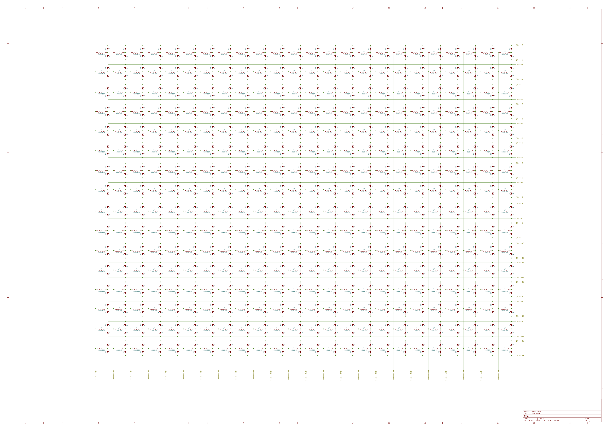

# FlipDotDisplay
3 old flip dot displays which need some work to get up and running.

They were bought at the Makerfaire Hannover 2016.

## Function

A dot on the display is switched by magnetising an inductor, which causes the colored dot (with a small magnet embedded) to change the orientation. Because the core of the inductor stays magnetized the state of the dot is stable even without being powered.

The inductors of the pixels are hooked up in an array with 24x16. Each column is connected to a single pin of the connector and each row has two inputs; one for positive voltage and one for negative (see FlipDotSchematic). By applying a voltage to a row and a column the corresponding pixel is flipped depending on the current flow direction. The original driver probably used two different power rails and sets of transistors to change the direction of the dot. 

The new driver will use a half-bridge configuration on each input to select the current flow direction. 

## ICs

* Half-bridge driver ICs: **L293D**
* Shift registers for output : **SN74HC595**
* Controller: **Atmega328p** (communicates via serial with the ESP8266)
* Interface for network: ESP8266 (Wemos D1 mini)

## ToDo

* Implement [Adafruit GFS library](https://github.com/adafruit/Adafruit-GFX-Library) to work with the FlipDotDisplay
* Pull tweets and display them (direct Hex code or text)
* more ?
